```{r setup, include=T, echo=FALSE}
knitr::opts_chunk$set(echo=FALSE, warning=FALSE, message=FALSE, kfigr.prefix=TRUE, kfigr.link=TRUE, comment=NA)
```

## Before starting 

Binaural audio examples need to be heard using headphones (both, left and rigth!!).
You can get this presentation and play the examples at

https://jundurraga.github.io/MAPS2018/#/


A printable version of this presentation can be obtained at

https://jundurraga.github.io/MAPS2018/?print-pdf#/

# Introduction

## Cocktail-party problem (Cherry, 1953)

How do we recognize what one person is saying when others are speaking at the same time?

When everyone at a well-attended party talks at the same level, the speech of the attended talker at a distance of 0.7 m has a signal-to-noise ratio (SNR) of about 0 dB (the background is as intense as the target talker Plomp 1977). 
This level is sufficient to give adequate intelligibility for listeners with normal hearing (Miller, 1947).


## Auditory scene analysis
- A critial role of the auditory system is to parse the inputs from the left and right ears into auditory objects - auditory scene analysis. This is an essential role for survival, recognition, and communication.

- Binaural hearing provides cues that allow us to estimate the relative number and location of sources and objects in the environment.

- These cues also help us to estimate the dimensions and characteristics of rooms as well as to hear out speakers in the presence of interfering noise.


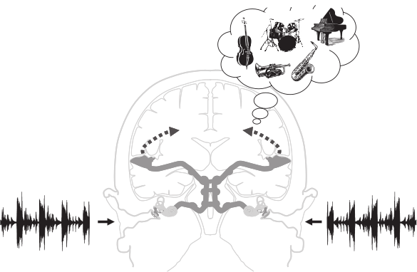

Grothe et al. (2010)

## 

>- When the speech sources are spatially separated, normal listeners can perceptually segregate and selectively attend to the
source of interest if the sounds arrive from the same location - **spatial release from masking (SRM) ** (Freyman et al., 1999; Brungart, 2001; Freyman
et al., 2001; Hawley et al., 2004)


>- This task is extreamly challenging for listeners with sensorineural hearing loss (with or without hearing aids) or cochlear implant users (Loizou et al., 2009; Marrone et al., 2008).


>- Moreover, listeners with "normal" hearing and elder listeners experience great difficulty when listening in the presence of background noise (Ruggles et al., 2011; Swaminathan et al., 2015; Gallun et al., 2013).

>- Hearing impaired listeners with symmetric binaural hearing often demonstrate reduced SRM primarily due to increased thresholds in spatially separated conditions (Arbogast et al., 2005; Marrone et al., 2008b; Best et al., 2012)

# Monaural and binaural cues

## Monaural 

## 


## Monaural cues and Auditory scence analysis

- Normal hearing listeners can segregate sounds remarkably well from monaural signals.
- The brain can use the statistical regularities of a sound to group acoustic characteristics that are likely originated from the same source.

<div id="left">
<br>
<br>
<br>
<li class="fragment" data-fragment-index="0"> common onset </li> 

<!-- Rasch, R. A. The perception of simultaneous notes such as in polyphonic -->
<!-- music. Acustica 40, 21–33 (1978). -->
<!-- Darwin, C. J. & Ciocca, V. Grouping in pitch perception: effects of onset -->
<!-- asynchrony and ear of presentation of a mistuned component. J. Acoust. Soc. -->
<!-- Am. 91, 3381–3390 (1992). -->
<li class="fragment" data-fragment-index="1"> harmonicity </li> 

<!-- Moore, B. C. J., Glasberg, B. R. & Peters, R. W. Thresholds for hearing -->
<!-- mistuned partials as separate tones in harmonic complexes. J. Acoust. Soc. Am. -->
<!-- 80, 479–483 (1986). -->
<!-- Hartmann, W. M., McAdams, S. & Smith, B. K. Hearing a mistuned harmonic -->
<!-- in an otherwise periodic complex tone. J. Acoust. Soc. Am. 88, 1712–1724 -->
<!-- (1990). -->
<!-- Brunstrom, J. M. & Roberts, B. Effects of asynchrony and ear of presentation -->
<!-- on the pitch of mistuned partials in harmonic and frequency-shifted complex -->
<!-- tones. J. Acoust. Soc. Am. 110, 391–401 (2001). -->
<!-- Bernstein, J. G. & Oxenham, A. J. Harmonic segregation through mistuning -->
<!-- can improve fundamental frequency discrimination. J. Acoust. Soc. Am. 124, -->
<!-- 1653–1667 (2008). -->
<!-- Fishman, Y. I. & Steinschneider, M. Neural correlates of auditory scene -->
<!-- analysis based on inharmonicity in monkey primary auditory cortex. J. -->
<!-- Neurosci. 30, 12480–12494 (2010). -->

<li class="fragment" data-fragment-index="2"> repetition </li> 

<!-- Kidd, G., Mason, C. R., Deliwala, P. S. & Woods, W. S. Reducing -->
<!-- informational masking by sound segregation. J. Acoust. Soc. Am. 95, -->
<!-- 3475–3480 (1994). -->
<!-- McDermott, J. H., Wrobleski, D. & Oxenham, A. J. Recovering sound sources -->
<!-- from embedded repetition. Proc. Natl. Acad. Sci. USA 108, 1188–1193 (2011). -->

</div>


<div id="rigth">
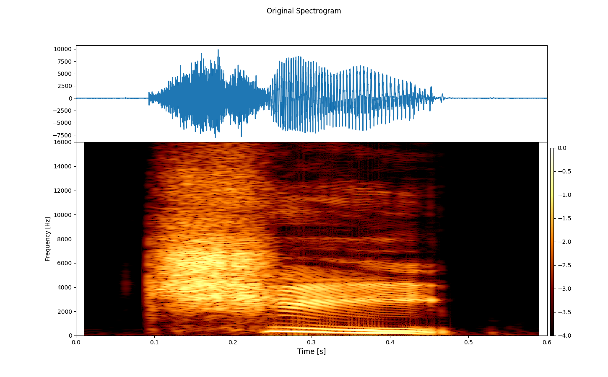 
</div>

## Harmonicity

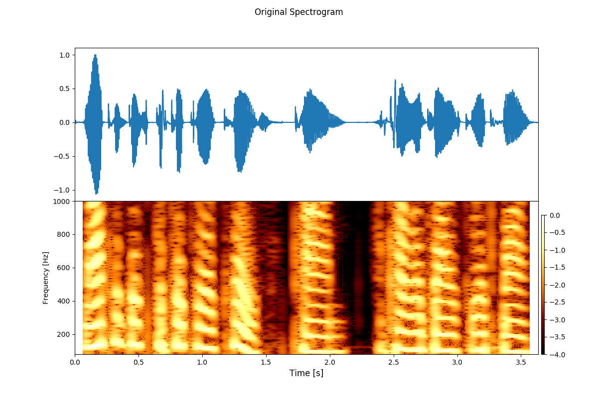 


## Which features conveyed by speech sounds?

- Temporal fine structure (TFS)
- Envelope information (ENV)

<li class ="fragment" data-fragment-index="0" data-audio-src="./audio/speech-davidvocoder.wav" data-audio-advance=-1> Play 6 Channel vocoder </li>
<li class ="fragment" data-fragment-index="1" data-audio-src="./audio/david.wav" data-audio-advance=-1> Play Original </li>

 


## Binaural cues

When listening to sounds, we rely on three mechanisms for both sound localization and auditory scene analysis 

<li class ="fragment" data-fragment-index="0"> Interaural level differences (ILDs) </li>

<li class ="fragment" data-fragment-index="1"> Interaural time differences (ITDs) </li>

<li class ="fragment" data-fragment-index="2"> Interaural coherence </li>


## ITDs and ILDs


## ILDs


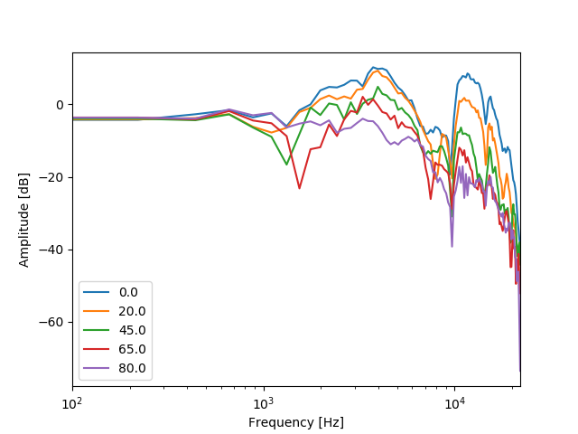 
<li class="fragment" data-fragment-index="2"> ILDs only useful for frequencies higher than 1200 Hz </li> 
<li class="fragment" data-fragment-index="3"> ILDs can be as large as 20 dB (e.g. Bronkhorst &
Plomp, 1988) </li> 

<li class="fragment" data-fragment-index="3">
ILDs resulting from the **head shadow** provide an advantage by sheltering the ear turned toward the target source from noise from the other side.
However, listeners with unilateral hearing loss struggle when the target sound comes from the impaired side, specially in the presence of background noise.
</li> 


## Localization using ITDs

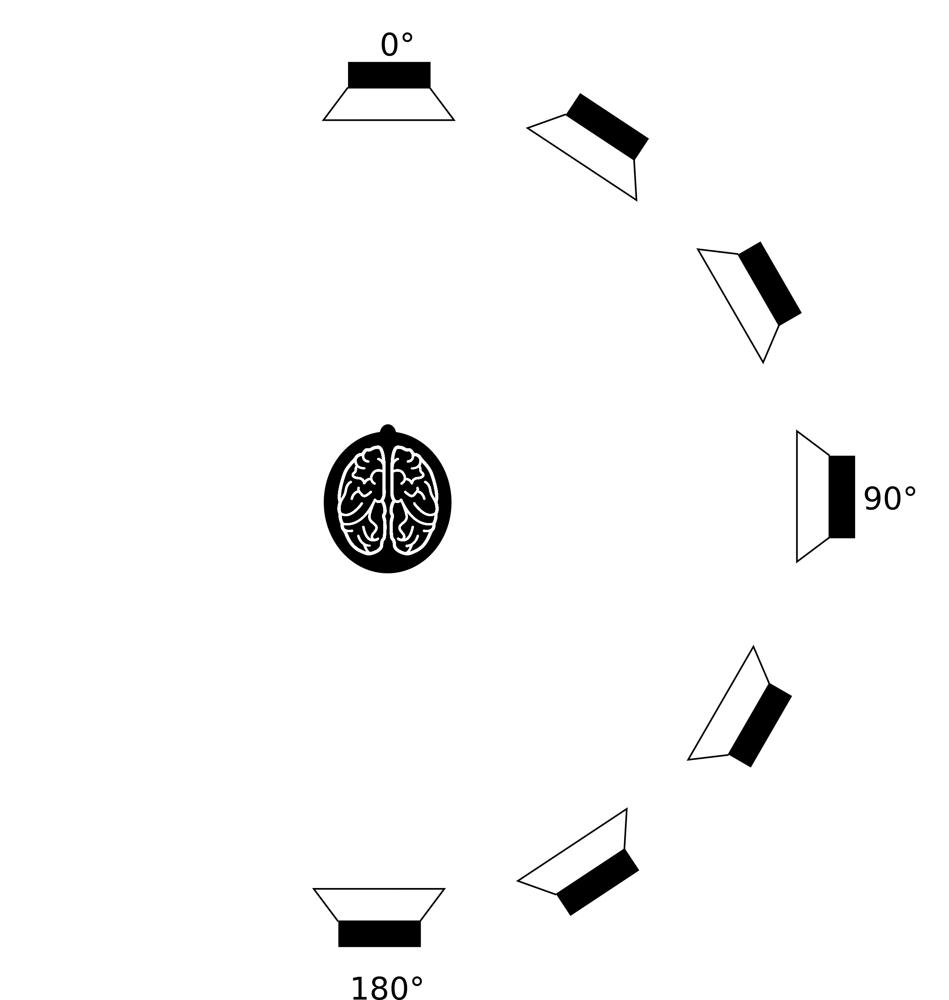
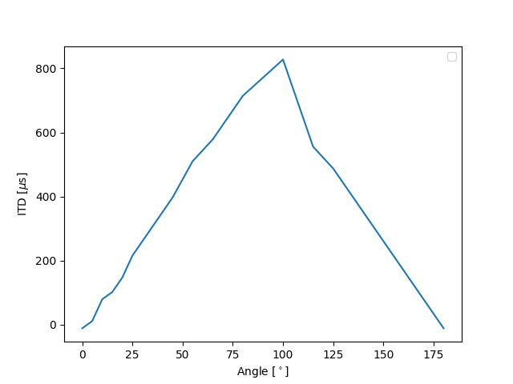

<li class="fragment" data-fragment-index="2"> 
ITDs within the physiological range experienced by human listeners about ±760 μs; (e.g. Constan and Hartmann (2003) and Hartmann and Macaulay (2014)) </li>

<li class="fragment" data-fragment-index="3">
ITDs (using fine structure) are useful for frequencies below  1500 Hz
</li>

<li class="fragment" data-fragment-index="4">
ITDs in the envelope of the signal are also used to determine the location of a source in both lower and higher frequencies.
</li>

## Temporal fine structure and envelope ITDs

<div id="left50">

<p class="fragment" data-fragment-index="0"> 500 Hz tone TFS left-to-right </p>


<p class="fragment" data-fragment-index="1"> Modulated 500 Hz tone <br> with envelope itd (ipd) left-to-right</p>
</div>

<div id="rigth50">
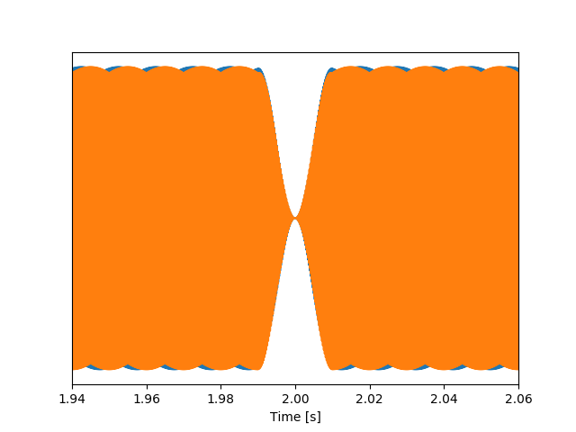
<p class="fragment" data-fragment-index="2"> 4000 Hz tone TFS itd (ipd) left-to-rigth </p>

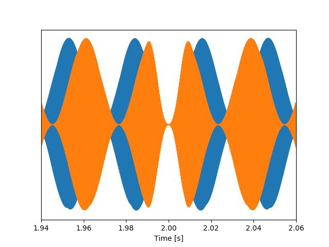
<p class="fragment" data-fragment-index="3"> Modulated 4000 Hz tone <br> with envelope itd left-to-rigth </p>
</div>


## Localization using ITDs

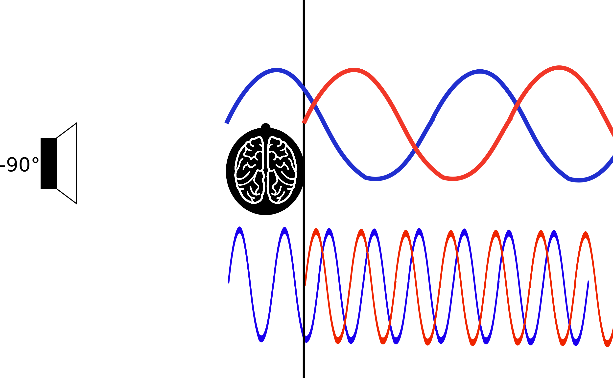

<li class="fragment" data-fragment-index="1"> 
ITDs are ambiguous for frequencies which half-wavelengths are smaller than the head 'diameter'.
</li>


## Localization on the vertical plane

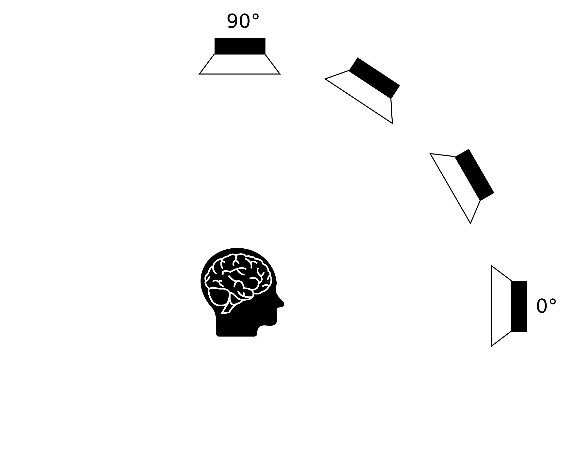
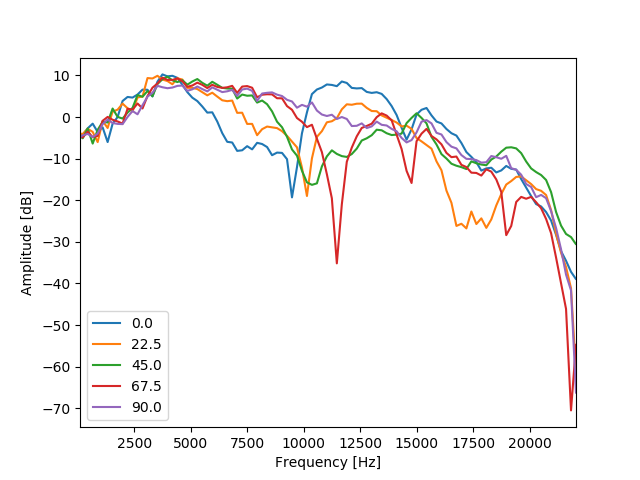

<li class="fragment" data-fragment-index="2"> The main cues are provided by diffraction patterns by the head and pinna, which result in characteristic spectral dips 
</li>

<li class="fragment" data-fragment-index="3"> 
Hearing-impaired subjects have wider cochlear filters (increasing spectral smearing), preventing them to localize a source in the vertical plane.
</li>

## The precedence effect


<br>
(Dietz et al. 2013)

<li class="fragment" data-fragment-index="0"> 
A single auditory event is perceived at the direction of the first direct wave front (2 and 50 ms later, even when reflections are 10 dB louder)
</li>

<li class="fragment" data-fragment-index="1">
Asymmetric hearing loss, hearing impairment and ageing negatively affect the precedence effect (Akeroyd and Guy,
2011). This can only partially restored by hearing aids.
</li>
 
# Binaural processing and speech understanding

## Binaural Redundancy

- Loudness doubles when the two ears are used instead of one ear for a sound coming from the front of the listener (a single ear would require an increase of about 10 dB; Fletcher and Munson, 1933)

- Just noticeable differences in intensity and frequency improve with signal redundancy

- Speech recognition in the presence of background noise improves (Marrone 2008, Neher 2009)

- Hearing impairment may lead to a slightly weaker binaural benefit in patients  (Dillon, 2001)

- Binaural stimulation sounds can be louder than with a monaural presentation without causing discomfort (even true for CI-treated patient)

## Binaural Release from Masking (or Binaural Squelch; or Hirsh effect)

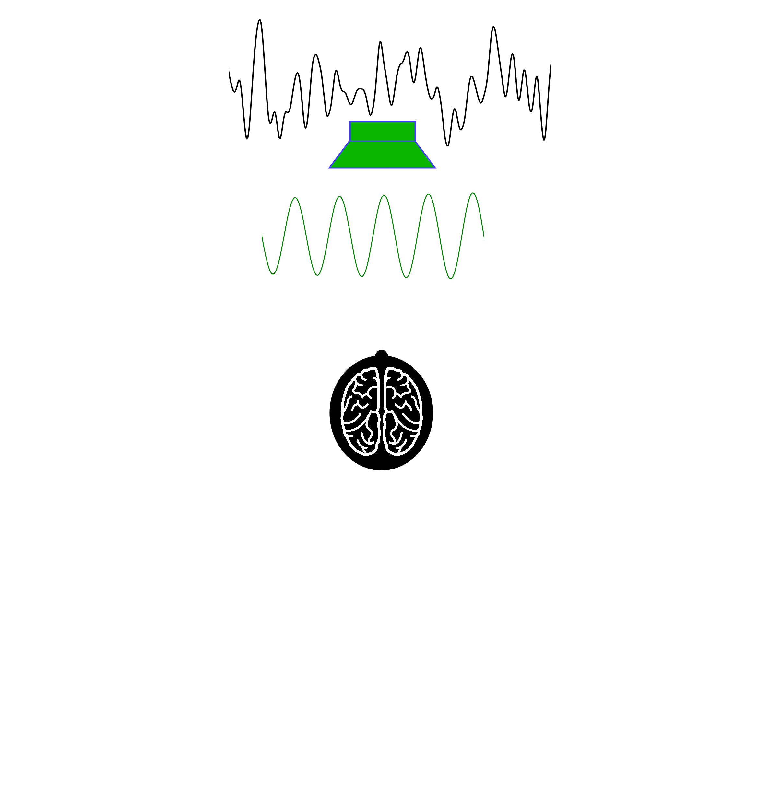
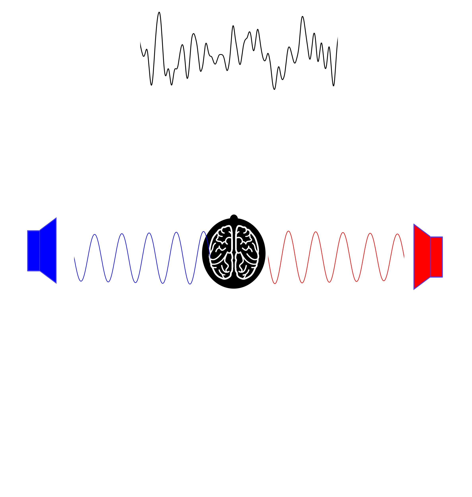

<li class="fragment" data-fragment-index="2"> Binaural release from masking may improve detection threshold up to about 16 dB for frequencies around 250 Hz and around 3 dB at 1500 Hz </li>

## Spatial Release from Masking  


<li class="fragment" data-fragment-index="2"> 
Binaural release from masking may improve detection thresholds up to 12 dB for multiple speech interferers (Jones and Litovsky, 2011), and facilitates source segregation provided that streaming can build up and natural onset cues are present (Drennan, Gatehouse, and Lever, 2003).
</li>

<li class="fragment" data-fragment-index="3"> 
Segregation is always better for the combination of both ITDs and ILDs cues (Culling, Hawley, and Litovsky 2004)
</li>

<li class="fragment" data-fragment-index="4"> 
A separation of only 10° between two voices is already strong enough to allow segregation  (Brungart and Simpson, 2007).
</li>


<li class="fragment" data-fragment-index="5"> ITD is a critical spatial cue for sound localization and speech perception in noise (Bronkhorst &
Plomp, 1988; Wightman & Kistler, 1992).
</li>


# What and where 


##

Input to one ear


<p class="fragment" data-fragment-index="1"> Output at the auditory nerve level </p>
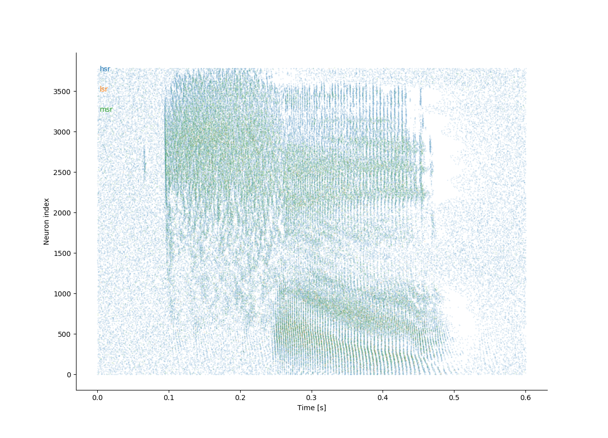

## Auditory pathway

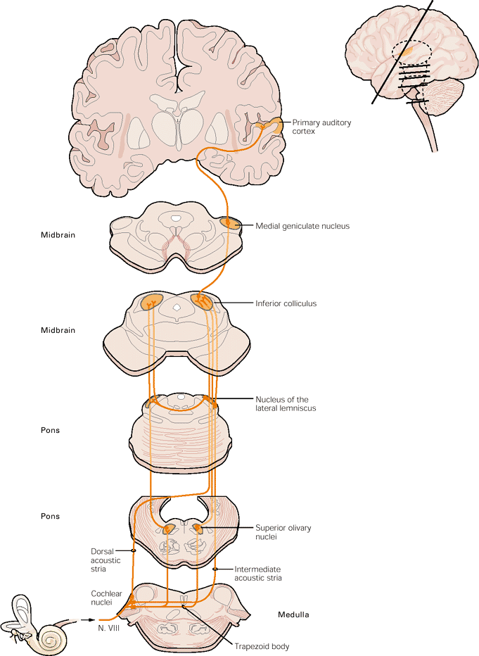


## ILD pathway

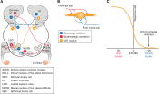

(Grothe et al. 2010)

<li class="fragment" data-fragment-index="0">
The initial site of ILD processing is generally considered to be the LSO.
</li>

<li class="fragment" data-fragment-index="1">
LSO are innervated by direct excitatory ipsilateral inputs from spherical bushy cells and inhibitory inputs indirectly originating from the globular bushy cells.
</li>

## ITD pathway


(Grothe et al. 2010)

<li class="fragment" data-fragment-index="0">
The initial site of ITD processing is considered to be the MSO.
</li>

<li class="fragment" data-fragment-index="1">
MSO are innervated by direct excitatory ipsi- anc contra-lateral inputs from spherical bushy cells and inhibitory inputs indirectly originating from the globular bushy cells.
</li>


# Objective detection of binaural processing in humans

## Electroencephalogram (EEG)


(From Luck 2005)

##


<li>
EEG allows to record electrical activity of the brain by means of electrodes placed along the scalp.
</li>


##

<li class="fragment" data-fragment-index="3">
Objective measures of binaural processing can be obtained by using stimuli where the temporal fine structure is manipulated so that the perceived location of the sound image changes periodically (e.g. 6.7 Hz) over time. 


(Undurraga et al. 2016)
</li>

##  Interaural-phase modulation

- The size of the interaural phase difference (relative ITD with respect to the frequency of the sound) will determine the lateralization of the sound.

<br>

||||
|-|-|-|
|<video width="320" height="240" controls source src="./my_figures/example-90.0_90.0.mp4" type="video/mp4">| <video width="320" height="240" controls source src="./my_figures/example-45.0_45.0.mp4" type="video/mp4">|<video width="320" height="240" controls source src="./my_figures/example-22.5_22.5.mp4" type="video/mp4">|

## Interaural-phase modulation following-responses (IPM-FR)

<ul class="fragment" data-fragment-index="0">

</ul>

<li class="fragment" data-fragment-index="1">
By swithcing the "sound image" from left to right at 6.7 Hz, a strong steady-state response is evoked at that particular frequency
</li>

<li class="fragment" data-fragment-index="2">
IPM-FRs are larger when the stimuli causes a strong lateralization percept.
</li>


## How well do objective IPM-FR and behavioural measurements correlate with each other?

Behavioural task

<ul class="fragment" data-fragment-index="0">
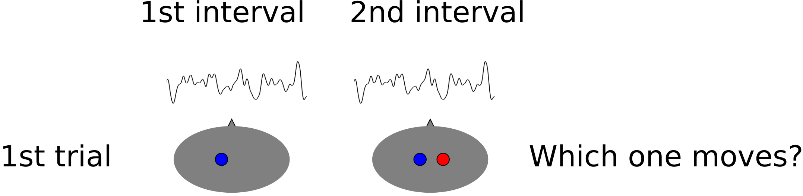
</ul>
<ul class="fragment" data-fragment-index="1">

</ul>
<ul class="fragment" data-fragment-index="2">

</ul>

<ul class="fragment" data-fragment-index="3">
The level of the masking noise to perform at chance is determined and compared and then compared with brain responses (IPM-FR)
</ul>

## Behavioural vs. Objective measures


<ul class="fragment" data-fragment-index="3">
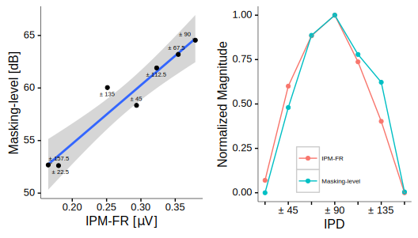
</ul>

<li class="fragment" data-fragment-index="4">
The correlation between objective and behavioural measurements is excellent (r = 0.96)
</li>


## The effect of age and hearing loss in objective binaural measures

- Does the IPM-FR differ between healthy and impaired hearing listeners?

<ul class="fragment" data-fragment-index="0"> Vercammen et al. (2018) </ul>

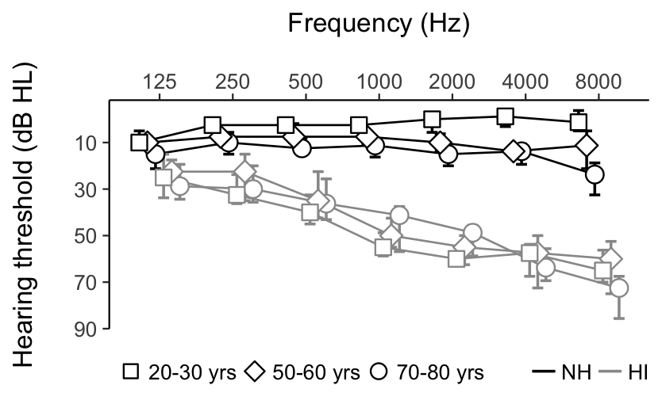

<li class="fragment" data-fragment-index="1">
Interaural difference in hearing thresholds near the stimulation frequency (500 Hz) did not exceed 10 dB HL.
</li>

<li class="fragment" data-fragment-index="2">
The stimulus level was 65 dB SPL for normal listeners.
</li>

<li class="fragment" data-fragment-index="3">
The stimulus level for hearing impaired listeners was adjusted using visual analogue scale (“inaudible”, “very soft”, “soft”, “comfortable”, “loud”, “very loud”, and “uncomfortably loud”). 
The subjective loudness was adjusted to match that of normal listeners.
</li>

##

Stimuli were amplitude modulated tones (500 Hz) using IPDs ranging from 0 (diotic) to 180 (dichotic).

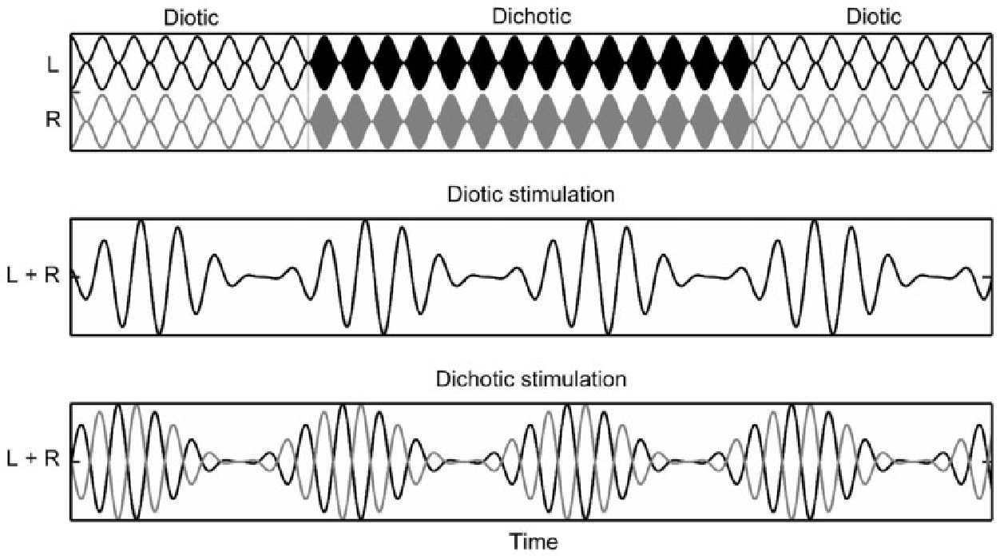

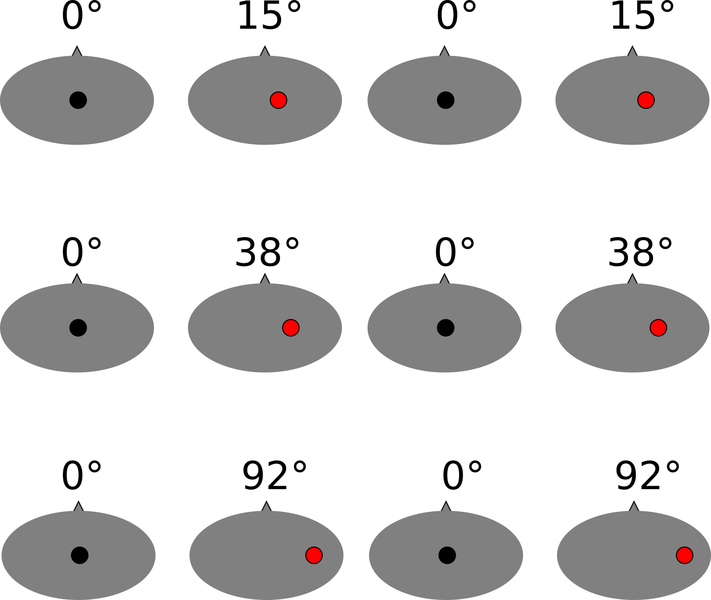


##

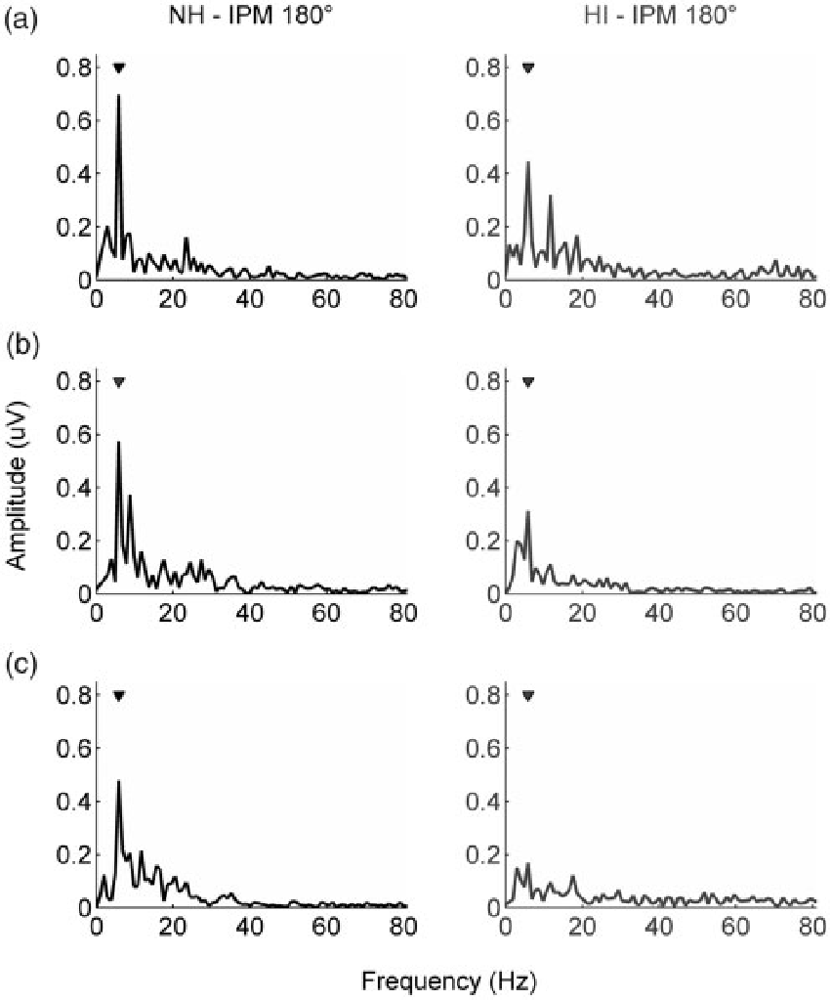


<li class="fragment" data-fragment-index="0">
Binaural processing of low frequency sounds is significantly deteriorated by age and hearing status.
</li>

<li class="fragment" data-fragment-index="1">
A larger IPM-FR dynamic range was associated with lower (better) IPD discrimination.
</li>


## Conclusions


<li class="fragment" data-fragment-index="0">
Interaural level and, in particular, interaural time differences conveyed by low frequencies (< 1500 Hz) are critical for speech understanding and segregation in the cocktail party problem (e.g. Swaminathan et al. 2016)
</li>

<!-- <li class="fragment" data-fragment-index="0"> -->
<!-- Interaural time differences are the main cue used to determine the horizontal position below 1.5 kHz and provide an strong cue for segreating multiple sources. -->
<!-- </li> -->

<li class="fragment" data-fragment-index="1">
Hearing-impaired listeners who typically find noisy environments disproportionately difficult for understanding speech, whether they wear a hearing aid or not (Killion 1997; Moore 1998).
</li>

<li class="fragment" data-fragment-index="2">
Similar problems are encountered by users of cochlear implants, again owing to the limited frequency resolution available with implants (Clark 2003).
</li>

<li class="fragment" data-fragment-index="3"> 
Binaural release from masking may improve detection thresholds up to 12 dB for multiple speech interferers (Jones and Litovsky, 2011), and facilitates source segregation provided that streaming can build up and natural onset cues are present (Drennan, Gatehouse, and Lever, 2003).
</li>

<li class="fragment" data-fragment-index="4"> 
Segregation is always better for the combination of both ITDs and ILDs cues (Culling, Hawley, and Litovsky 2004)
</li>

<li class="fragment" data-fragment-index="5">
Objective measures of binaural processing agree with difficulties to localize and understand speech in observed in hearing impaired and elder listeners.
</li>


## Acknowledgments

- Organization for inviting us!!!
- Australian Research Council [project number FL160100108]
- Thanks to you for "listening"


<br>


<!-- ## References -->