```{r setup, include=T, echo=FALSE}
knitr::opts_chunk$set(echo=FALSE, warning=FALSE, message=FALSE, kfigr.prefix=TRUE, kfigr.link=TRUE, comment=NA)
```


# Introduction

## Cocktail-party problem [@CherryExperimentsRecognitionSpeech1953]

How do we recognize what one person is saying when others are speaking at the same time?


##
- An critial role of the auditory system is to parse the inputs from the left and right ears into auditory objects - auditory scene analysis. This is an escential role for survival, recognition, and comunication.

- Binaural hearing provide us cues to estimate the relative number and location of sources and objects in the environment.
- These cues also help us to estimate the dimensions and characteristics of rooms as well as hear out spearkers in the precense of interfiearing noise.


Grothe et al. (2010)

# Monaural and binaural cues

## Monaural 

- Normal hearing listeners can segregate sounds remarkably well from monaural signals.
- The brain can use the statistical regularities of a sound to group acoustic energy that is likely originated from the same source.

<div id="left">
<br>
<br>
<br>
<li class="fragment" data-fragment-index="0"> common onset </li> 

<!-- Rasch, R. A. The perception of simultaneous notes such as in polyphonic -->
<!-- music. Acustica 40, 21–33 (1978). -->
<!-- Darwin, C. J. & Ciocca, V. Grouping in pitch perception: effects of onset -->
<!-- asynchrony and ear of presentation of a mistuned component. J. Acoust. Soc. -->
<!-- Am. 91, 3381–3390 (1992). -->
<li class="fragment" data-fragment-index="1"> harmonicity </li> 

<!-- Moore, B. C. J., Glasberg, B. R. & Peters, R. W. Thresholds for hearing -->
<!-- mistuned partials as separate tones in harmonic complexes. J. Acoust. Soc. Am. -->
<!-- 80, 479–483 (1986). -->
<!-- Hartmann, W. M., McAdams, S. & Smith, B. K. Hearing a mistuned harmonic -->
<!-- in an otherwise periodic complex tone. J. Acoust. Soc. Am. 88, 1712–1724 -->
<!-- (1990). -->
<!-- Brunstrom, J. M. & Roberts, B. Effects of asynchrony and ear of presentation -->
<!-- on the pitch of mistuned partials in harmonic and frequency-shifted complex -->
<!-- tones. J. Acoust. Soc. Am. 110, 391–401 (2001). -->
<!-- Bernstein, J. G. & Oxenham, A. J. Harmonic segregation through mistuning -->
<!-- can improve fundamental frequency discrimination. J. Acoust. Soc. Am. 124, -->
<!-- 1653–1667 (2008). -->
<!-- Fishman, Y. I. & Steinschneider, M. Neural correlates of auditory scene -->
<!-- analysis based on inharmonicity in monkey primary auditory cortex. J. -->
<!-- Neurosci. 30, 12480–12494 (2010). -->

<li class="fragment" data-fragment-index="2"> repetition </li> 

<!-- Kidd, G., Mason, C. R., Deliwala, P. S. & Woods, W. S. Reducing -->
<!-- informational masking by sound segregation. J. Acoust. Soc. Am. 95, -->
<!-- 3475–3480 (1994). -->
<!-- McDermott, J. H., Wrobleski, D. & Oxenham, A. J. Recovering sound sources -->
<!-- from embedded repetition. Proc. Natl. Acad. Sci. USA 108, 1188–1193 (2011). -->

</div>


<div id="rigth">
 
<li class ="fragment" data-fragment-index="3" > Play speech </li>
</div>

## Harmonicity

 
<li class ="fragment" data-fragment-index="4" data-audio-src="./audio/sentences/arctic_a0002.wav" data-audio-advance=-1> Play sentence </li>


## What features conveyed by speech sounds?

- Temporal fine structure (TFS)
- Envelope information (ENV)

<li class ="fragment" data-fragment-index="0" data-audio-src="./audio/speech-davidvocoder.wav" data-audio-advance=-1> Play 6 Channel vocoder </li>
<li class ="fragment" data-fragment-index="1" data-audio-src="./audio/david.wav" data-audio-advance=-1> Play Original </li>

 


## Binaural cues

We listening to sounds, we rely on three mechanims for both localize a source and to perform sound source analysis 

- Interaural level differences (ILDs)

- Interaural time differences (ITDs)

## ITDs and ILDs


## ILDs


 
<li class="fragment" data-fragment-index="2"> ILDs only useful for frequencies higher than 1200 Hz </li> 
<li class="fragment" data-fragment-index="3"> ILDs can be as large as 20 dB (e.g. Bronkhorst &
Plomp, 1988) </li> 

<li class="fragment" data-fragment-index="3">
ILDs resulting from the **head shadow** provide an advantage by sheltering the ear turned toward the target source from noise from the other side.
However, listeners with unilateral hearing loss stragle when the target sound comes from the impaired side, specially in the prensece of background noise.
</li> 


## Localization using ITDs


<li class="fragment" data-fragment-index="2"> 
ITDs within the physiological range experienced by human listeners about ±760 μs; (e.g. Constan and Hartmann (2003) and Hartmann and Macaulay (2014)) </li>

<li class="fragment" data-fragment-index="3">
ITDs (using fine structure) are useful for frequencies below  1500 Hz
</li>

<li class="fragment" data-fragment-index="3">
ITDs in the envelope of the signal are also used determine the location of a source in both (lower and higher frequencies)
</li>

##

<div id="left50">
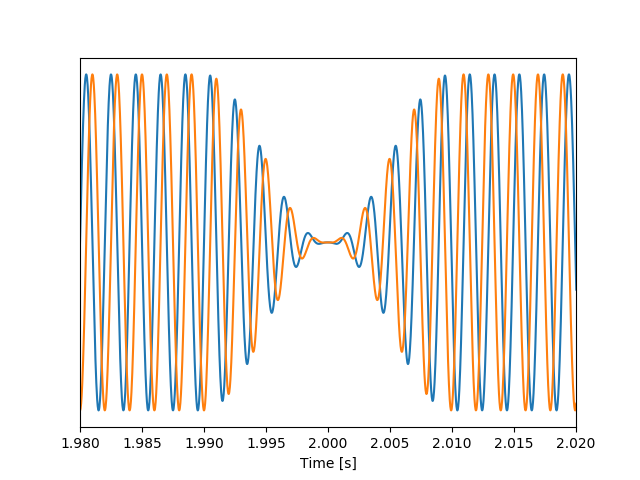
<p class="fragment" data-fragment-index="0"> 500 Hz tone TFS left-to-right </p>


<p class="fragment" data-fragment-index="1"> Modulated 500 Hz tone <br> with envelope itd (ipd) left-to-right</p>
</div>

<div id="rigth50">

<p class="fragment" data-fragment-index="2"> 4000 Hz tone TFS itd (ipd) left-to-rigth </p>


<p class="fragment" data-fragment-index="3"> Modulated 4000 Hz tone <br> with envelope itd left-to-rigth </p>
</div>


## Localization using ITDs


<li class="fragment" data-fragment-index="1"> 
ITDs are ambiguous for frequencies which wavelenghts are smaller than the head 'diameter'.
</li>


## Localization on the vertical plane


<li class="fragment" data-fragment-index="2"> The main cues are provided by diffraction patterns by the head and pinna, which result in characteristic spectral dips 
</li>

<li class="fragment" data-fragment-index="3"> 
hearing-impaired subjects have wider cochlear filters (increasing spectral smearing), preventing them to localize a source in the vertical plane.
</li>

## The precedence effect


<br>
(Dietz et al. 2013)

<li class="fragment" data-fragment-index="0"> 
A single auditory event is perceived at the direction of the first direct wave front (2 and 50 ms later, even when reflections are 10 dB louder)
</li>

<li class="fragment" data-fragment-index="1">
Assymetric hearing loss, hearing impairment and ageing negatively affect the precedence effect (Akeroyd and Guy,
2011). This can only partially restored by hearing aids.
</li>
 
# Binaural processing and speech understanding

## Binaural Redundancy

- Loudness doubles when the two ears are used instead of one ear for a sound coming from the front of the listener (a single ear would require an increase of about 10 dB; Fletcher and Munson, 1933)

- Just noticeable differences in intensity and frequency improve with signal redundancy

- Speech recognition under the presence of background noise improves

- hearing impairment may lead to a slightly weaker binaural benefit in patients  (Dillon, 2001)

- binaural stimulation sounds can be louder than with a monaural presentation without causing discomfort (even true for CI-treated patient)

## Binaural Release from Masking (or Binaural Squelch; or Hirsh effect)


<li class="fragment" data-fragment-index="2"> Binaural release from masking may improve detection thesholds up to about 16 dB for frequencies around 250 Hz and around 3 dB at 1500 Hz </li>

## 


<li class="fragment" data-fragment-index="2"> 
Binaural release from masking may imrprobe detection thresholds up to 12 dB for multiple speech interferers(Jones and Litovsky, 2011), and facilitates source segregation provided that streaming can build up and natural onset cues are present (Drennan, Gatehouse, and Lever, 2003).
</li>

<li class="fragment" data-fragment-index="3"> 
Segregation is always better for the combination of both ITDs and ILDs cues (Culling, Hawley, and Litovsky 2004)
</li>

<li class="fragment" data-fragment-index="4"> 
A separation of only 10° bwtween two voices is already strong enough to allow segregation  (Brungart and Simpson, 2007).
</li>


<li class="fragment" data-fragment-index="5"> ITD is a critical spatial cue for sound localization and speech perception in noise (Bronkhorst &
Plomp, 1988; Wightman & Kistler, 1992).
</li>

##
Hearing-impaired listeners who typically find noisy environments disproportionately difficult for understanding speech, whether they wear a hearing aid or not (Killion 1997; Moore 1998)

their auditoryfilter bandwidths are wider than normal as a result of outer hair cell loss (see Moore 2008). The wider
bandwidths lead to both spectral smearing of auditory features and reduced signal-to-noise ratio in the
presence of background noise. Similar problems are encountered by users of cochlear implants, again owing
to the limited frequency resolution available with implants (Clark 2003).


Plomp (1977) has
calculated that when everyone at a well-attended party
talks at the same level, the speech of the attended talker
at a distance of 0.7 m has a signal-to-noise (S/N) ratio
of approximately 0 dB—the background is as intense as
the target talker

0 dB is sufficient to give adequate
intelligibility with normal pronunciation and redun-
dancy for listeners with normal hearing (Miller 1947)


AUDITORY SCENE ANALYSIS (Bregman 1990).

brain using two types of information to group together sound components that have originated from a common source: heuristics based on general properties of sound sources, and schematic knowledge about specific sounds. General properties such as the common onset and (for periodic
sounds) the harmonic relations between frequency components from a single source can help partition sounds from different sources that occur simul-
taneously; other properties, such as continuity of pitch, timbre, overall level and spatial location can help to track a single sound source across time

Bregman also recognizes that, as well as general heuristics, the brain may employ schema-based grouping 


# What and where 

## 


##


## Auditory pathway


## ILD pathway


(Grothe et al. 2010)

<li class="fragment" data-fragment-index="0">
The initial site of ILD processing is generally considered to be the LSO.
</li>

<li class="fragment" data-fragment-index="1">
LSO are innervated by direct excitatory ipsilateral inputs from spherical bushy cells and inhibitory inputs indirectly originating from the globular bushy cells.
</li>

## ITD pathway


(Grothe et al. 2010)

<li class="fragment" data-fragment-index="0">
The initial site of ITD processing is considered to be the MSO.
</li>

<li class="fragment" data-fragment-index="1">
MSO are innervated by direct excitatory ipsi- anc contra-lateral inputs from spherical bushy cells and inhibitory inputs indirectly originating from the globular bushy cells.
</li>


# Objective detection of binaural processing in humans

## Electroencephalogram 


(From Luck 2005)


##
  - Interaural time differences (ITDs)  are the main cue used by humans and other mammals to determine the horizontal position below 1.5 kHz.
- ITD sensitivity is achieved by coincidence-detecting neurons in the superior olive - the first structure of binaural processing in the auditory pathway.

|a|b|c|
|-|-|-|
|<video width="320" height="240" controls source src="./my_figures/example-90.0_90.0.mp4" type="video/mp4">| <video width="320" height="240" controls source src="./my_figures/example-45.0_45.0.mp4" type="video/mp4">|<video width="320" height="240" controls source src="./my_figures/example-22.5_22.5.mp4" type="video/mp4">|

## 
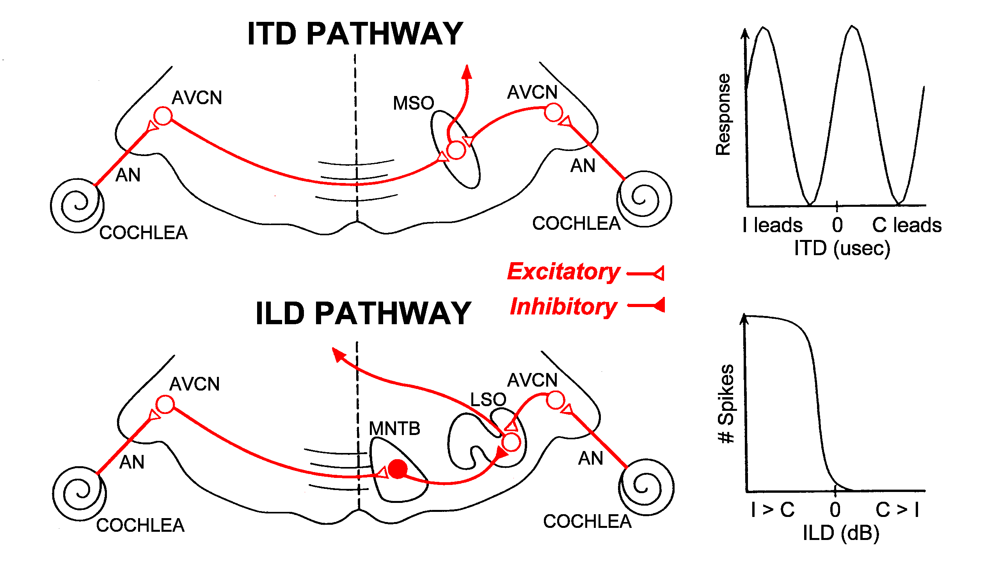


<!-- <p class ="fragment" data-fragment-index="1"  data-audio-src="audio/D-8_0e+0_CF-5_0e+0_CP-7_9e-0_CA--7_9e-_MF-4_0e+0_MI-1_0e+0_CN-1_7e-0_F-4_4e+0_N-1_0e+0_A-1_0e+0_CP-2_0e+0_MP-0_0e+0_IT-1_0e+0_PW-5_0e-0_TA-1_0e+0__CR-4_4e+0_SW-1_0e+0__RF-0_0e+0_D-_.wav" data-audio-advance=-1 <p> -ipm-fr </p>> -->


<li class ="fragment" data-audio-src="audio/david.wav" data-audio-advance=-1> audio 1 </li>

<li class ="fragment"  data-audio-src="audio/D-8_0e+0_CF-5_0e+0_CP-7_9e-0_CA--7_9e-_MF-4_0e+0_MI-1_0e+0_CN-1_7e-0_F-4_4e+0_N-1_0e+0_A-1_0e+0_CP-2_0e+0_MP-0_0e+0_IT-1_0e+0_PW-5_0e-0_TA-1_0e+0__CR-4_4e+0_SW-1_0e+0__RF-0_0e+0_D-_.wav" data-audio-advance=-1> audio 2 </li>


<!-- >- <audio data-autoplay class="fragment" data-audio-src="audio/david.wav" data-audio-advance=-1></audio> -->

# Models for ITD processing

## Straightness weighting


- Peaks of the cross-correlograms at –1.5 ms < peaks closer to 0 - central weighting.

- Correct localization estimated from second processing level (in the inferior colliculus, gray curve on top of each panel).


## The $\pi$-limit 

<!-- - Findings in small mammals suggest that this sort of model may be implausible, even with the inclusion of straightness weighting.  -->

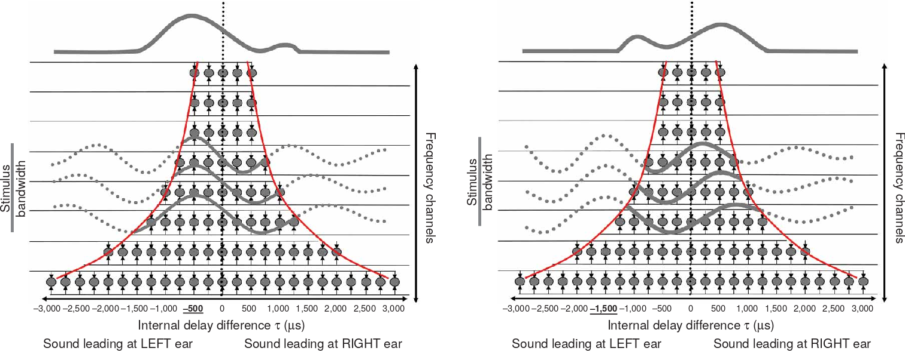 

- ITD detectors in the mammalian brain restricted to $\approx$ half a cycle of best frequency. 
- Frequency-dependent weighting for centrality


##
@thompson_representation_2006
 


## 
- Inferior colliculus consistent with the $\pi$␲-limit.
- Cortical responses to sounds with ITDs within the $\pi$-limit are in line with the predictions of both models. 
- However, neural activation is bilateral for "long" ITDs, despite these being perceived as clearly lateralized
- Long ITDs leads to higher activation in cortex than processing of short ITDs.

##
@kriegstein_responses_2008

 


# Aims

##
- to evaluate how short and long ITDs are processed in the human cortex using EEG recordings

## Methods

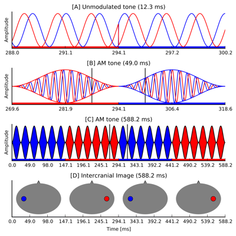

## Stimuli

- 500 Hz bandwidth modulated noise (40.4 Hz) centered at 500 Hz
- Periodics interaural time moulations at 6.7 Hz (ITM-FRs)

|   |   |
|---|---|
||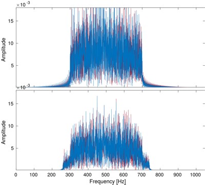|


## Recordings

- 10 normal hearing participants
- 66 channels Biosemi active electrode system
- 5 minutes recordings

Analysis: 

- low pass filter 60Hz, high pass filter 2Hz
- automatic removal of bad channels
- denoising source separation
- weighted average


# Experiment 1

## Straightness weighting

|   |   |
|---|---|
|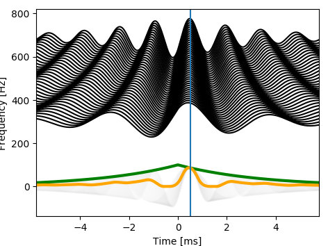||
|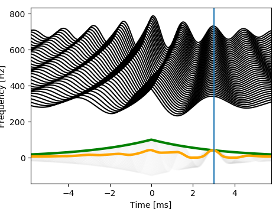||


##

ITM-FRs obtained by switching between:

- 0 / 0.5 ms  
- 0 / 1.5 ms
- 0 / 2.0 ms
- 0 / 3.0 ms
- 0 / 4.0 ms


# Results

## Example responses


## 

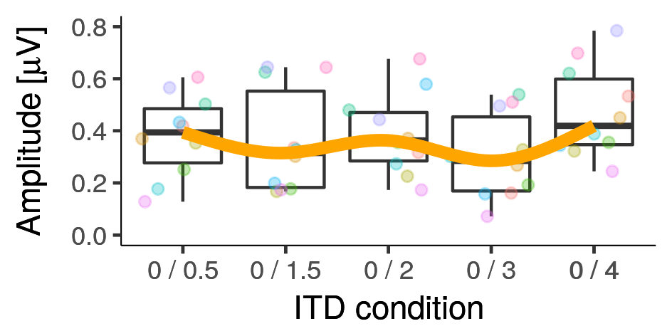

- ANOVA indicated that factor ITD condition was significant (F(4, 35.04) = 7.5, p = 0.0001)


# Experiment 2 Adapting binaural detectors

##

|   |   |
|---|---|
|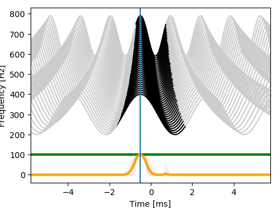||
|||

##

|   |   |
|---|---|
|||

##

ITM-FRs obtained by switching between:

- -0.5 / 0.5 ms
- -0.5 / 1.5 ms
-  0.5 / 1.5 ms


# Results 

##

|   |   |
|---|---|
|||


# Experiment 3 Coherence changes

##

ITM-FR obtained by switching between  

- -0.5 / 0.5 ms
- -1.0 / 1.0 ms
- -1.5 / 1.5 ms
- -2.0 / 2.0 ms
- -2.5 / 2.5 ms
- -3.0 / 3.0 ms
- -3.5 / 3.5 ms
- -4.0 / 4.0 ms

# Results

##

|   |   |
|---|---|
|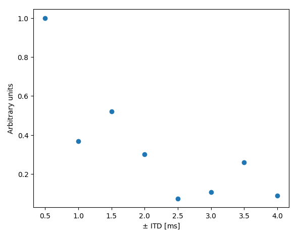|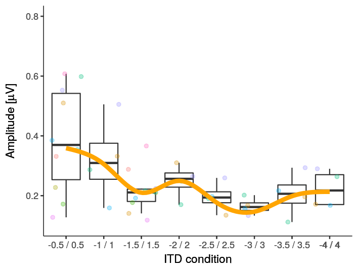|


## Conclusions

- Experiment 1 suggests that ITM-FRs do not decrease with ITD size when switching from zero.

- Experiment 2 shows that ITM-FR adaptation pattern is in line with the $\pi$-limit model.

- ITM-FRs obtained with symmetric ITDs show a decaying damping-like pattern peaking at multiple periods of the center frequency. 


## References